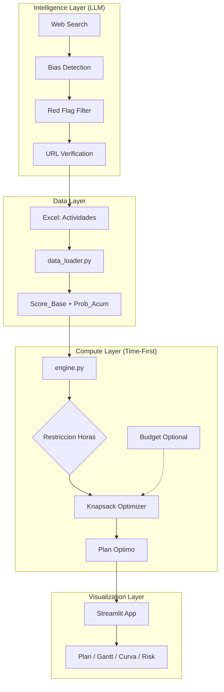
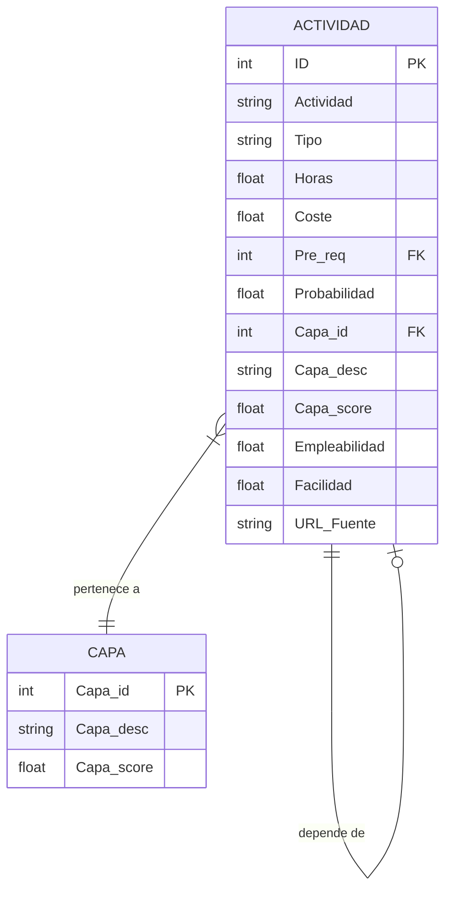
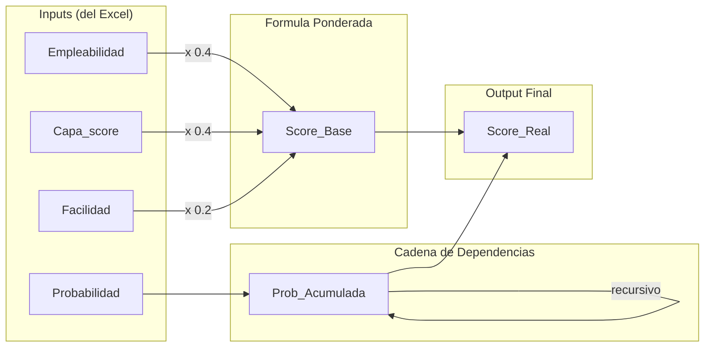
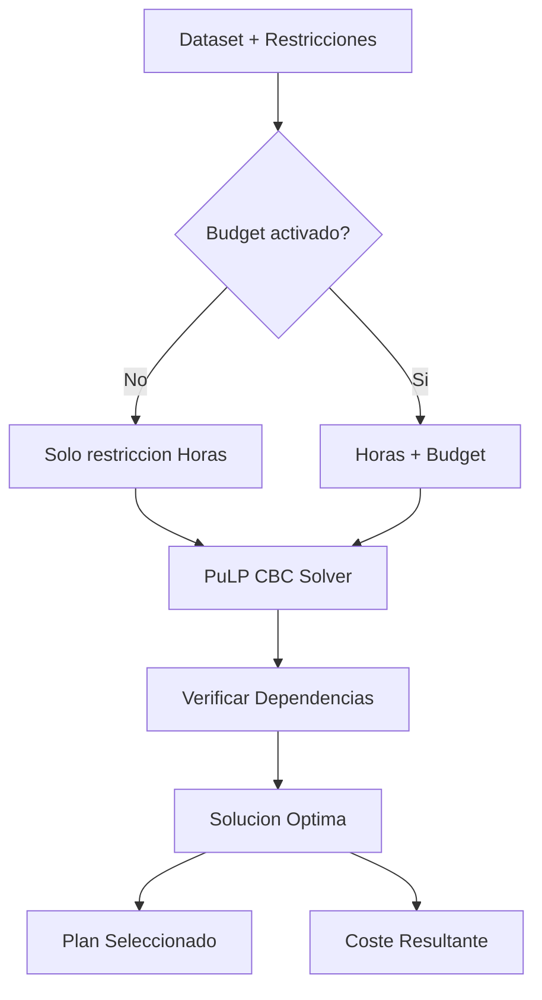
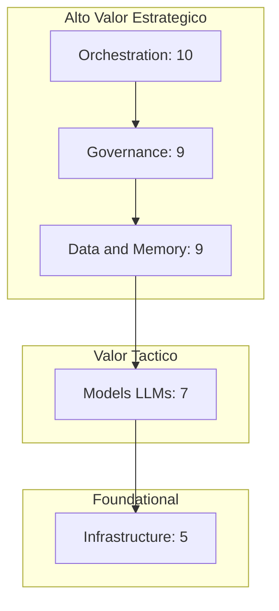
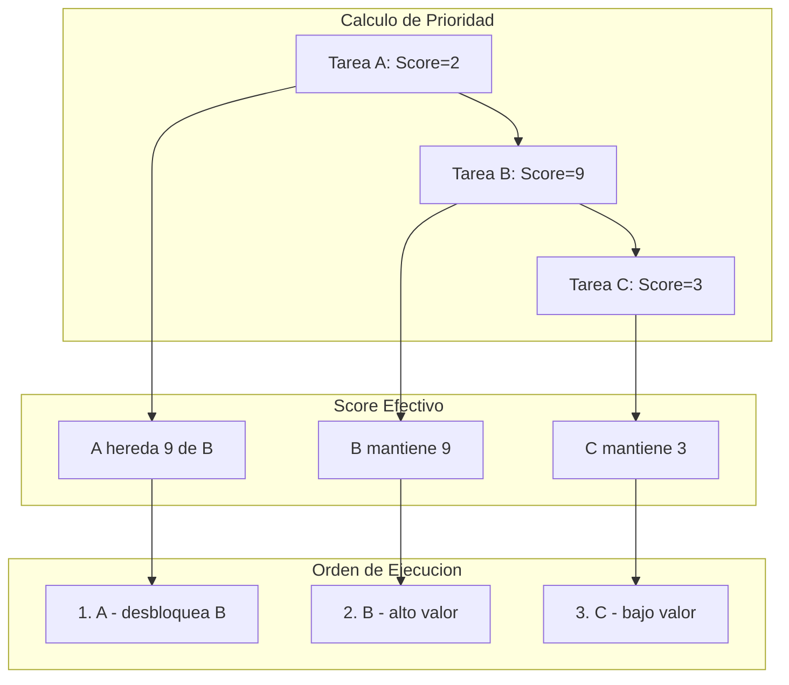
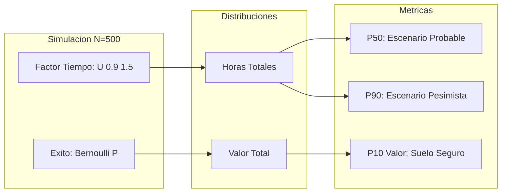
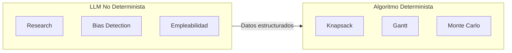

# SPO Architecture

Documentación técnica de la arquitectura del Strategic Portfolio Optimizer.

---

## 1. Flujo Principal (Time-First)

---

## 2. Modelo de Datos

---

## 3. Flujo de Calculo del Score

---

## 4. Algoritmo Knapsack (Time-First)

---

## 5. Taxonomia de Capas

---

## 6. Gantt con Score Heredado

---

## 7. Monte Carlo

---

## 8. Componentes del Sistema

| Componente | Archivo | Responsabilidad |
|------------|---------|-----------------|
| UI | app.py | Streamlit dashboard, visualizaciones |
| ETL | data_loader.py | Carga Excel, calculo Score_Base, Prob_Acum |
| Optimizer | engine.py | Knapsack, Gantt, Monte Carlo |
| Prompt | AI_Trend_Scanner_v2.2.md | Research + bias detection |
| Data | Roadmap_2026.xlsx | Dataset con URLs |

---

## 9. Principio de Diseno: Hibrido

**Principio:** Usar LLMs para lo que son buenos (analisis no estructurado, deteccion de patrones) y algoritmos deterministas para lo que requiere garantias matematicas (optimizacion, scheduling).

---

## 10. Decisiones Tecnicas

| Decision | Alternativa descartada | Razon |
|----------|------------------------|-------|
| PuLP/CBC | Gurobi, CPLEX | Gratuito, suficiente para N<100 |
| Streamlit | Dash, Gradio | Mas rapido para prototipos |
| Excel como fuente | SQLite, Postgres | Portabilidad, edicion manual facil |
| Time-First | Dual constraint | Evidencia estadistica: Horas siempre binding |
