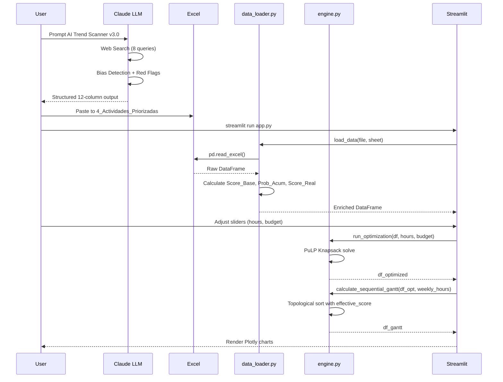
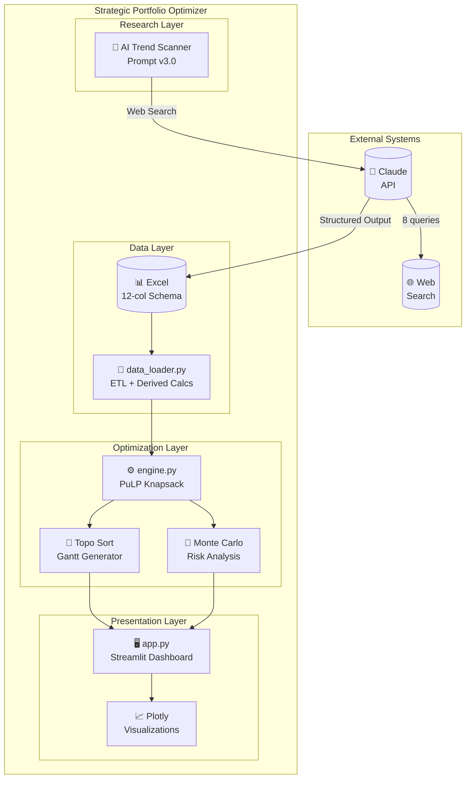
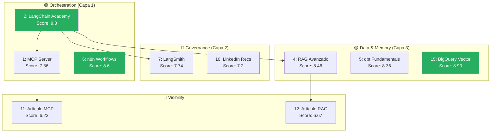

# 🏗️ Arquitectura del Sistema SPO

> **Strategic Portfolio Optimizer — Documentación Técnica de Arquitectura**

## 📋 Índice

1. [Visión General](#1-visión-general)
2. [Componentes del Sistema](#2-componentes-del-sistema)
3. [Flujo de Datos](#3-flujo-de-datos)
4. [Diagramas](#4-diagramas)
5. [ADRs (Decisiones de Arquitectura)](#5-adrs-decisiones-de-arquitectura)

---

## 1. Visión General

### 1.1 Patrón Arquitectónico

SPO implementa un patrón **Hybrid AI Pipeline** que combina:

| Componente | Tecnología | Paradigma |
|------------|------------|-----------|
| Research Agent | Claude LLM + Web Search | Generativo (No determinista) |
| Data Layer | Excel/Pandas | Estructurado (Determinista) |
| Optimization Engine | PuLP | Matemático (Determinista) |
| Visualization | Streamlit | Reactivo |

### 1.2 Principios de Diseño

1. **Separation of Concerns** — Cada módulo tiene una única responsabilidad
2. **Deterministic Core** — La optimización es reproducible y auditable
3. **Human-in-the-Loop** — El LLM informa, el humano decide
4. **Time-First** — El tiempo es la restricción principal, no el dinero

---

## 2. Componentes del Sistema

### 2.1 AI Research Agent (`AI_TREND_SCANNER_v3.0`)

```
┌─────────────────────────────────────────────────────────────┐
│                    AI TREND SCANNER                         │
├─────────────────────────────────────────────────────────────┤
│                                                             │
│  INPUT                        PROCESS                       │
│  ┌──────────────┐            ┌──────────────────────────┐   │
│  │ [PROFILE]    │            │ FASE 1: Web Search (8)   │   │
│  │ [INPUT_DATA] │ ────────▶  │ FASE 2: Identificación   │   │
│  │ [QUERIES]    │            │ FASE 3: Detección Sesgos │   │
│  └──────────────┘            │ FASE 4: Red Flags        │   │
│                              │ FASE 5: Evaluación       │   │
│  OUTPUT                      └──────────────────────────┘   │
│  ┌──────────────────────────────────────────────────────┐   │
│  │ 12-column structured output (same schema as input)   │   │
│  │ + Changelog with justifications                      │   │
│  └──────────────────────────────────────────────────────┘   │
│                                                             │
└─────────────────────────────────────────────────────────────┘
```

**Responsabilidad:** Análisis de tendencias de mercado y generación de actividades priorizadas.

**Características clave:**
- 8 queries de búsqueda web predefinidas
- Detección de 3 tipos de sesgo (HYPE, VENDOR, SURVIVORSHIP)
- 6 Red Flags para descarte automático
- Output estructurado con 12 columnas

### 2.2 Data Loader (`data_loader.py`)

```python
┌─────────────────────────────────────────────────────────────┐
│                      DATA LOADER                             │
├─────────────────────────────────────────────────────────────┤
│                                                              │
│  ┌─────────────┐    ┌─────────────┐    ┌─────────────────┐  │
│  │ Excel File  │───▶│ Normalize   │───▶│ Calculate       │  │
│  │ .xlsx       │    │ Headers     │    │ Derived Fields  │  │
│  └─────────────┘    └─────────────┘    └─────────────────┘  │
│                                                │             │
│                                                ▼             │
│                     ┌──────────────────────────────────┐    │
│                     │ DERIVED CALCULATIONS             │    │
│                     │ ─────────────────────────────────│    │
│                     │ Score_Base = E×0.4 + C×0.4 + F×0.2│   │
│                     │ Prob_Acumulada = recursive()      │    │
│                     │ Score_Real = Base × Prob_Acum     │    │
│                     │ ROI = Score_Real / Coste          │    │
│                     └──────────────────────────────────┘    │
│                                                              │
└─────────────────────────────────────────────────────────────┘
```

**Responsabilidad:** ETL y cálculo de métricas derivadas.

**Funciones principales:**
- `load_data(file_path, sheet_target)` → `(df, df_original)`
- Normalización de cabeceras
- Cálculo recursivo de probabilidad acumulada
- Cacheo con `@st.cache_data`

### 2.3 Optimization Engine (`engine.py`)

```python
┌─────────────────────────────────────────────────────────────┐
│                   OPTIMIZATION ENGINE                        │
├─────────────────────────────────────────────────────────────┤
│                                                              │
│  ┌───────────────────────────────────────────────────────┐  │
│  │                 KNAPSACK OPTIMIZER                     │  │
│  │  ─────────────────────────────────────────────────────│  │
│  │  Maximize: Σ (Score_Real_i × x_i)                     │  │
│  │  Subject to:                                          │  │
│  │    Σ (Horas_i × x_i) ≤ hours        [Time]           │  │
│  │    Σ (Coste_i × x_i) ≤ budget       [Budget, opt]    │  │
│  │    x_i ≤ x_prereq(i)                [Dependencies]   │  │
│  │    x_i ∈ {0, 1}                     [Binary]         │  │
│  └───────────────────────────────────────────────────────┘  │
│                            │                                 │
│                            ▼                                 │
│  ┌───────────────────────────────────────────────────────┐  │
│  │              TOPOLOGICAL GANTT                        │  │
│  │  ─────────────────────────────────────────────────────│  │
│  │  1. Build dependency graph (DAG)                      │  │
│  │  2. Calculate effective_score (back-propagation)      │  │
│  │  3. Priority queue by effective_score DESC            │  │
│  │  4. Sequential scheduling with resource constraint    │  │
│  └───────────────────────────────────────────────────────┘  │
│                            │                                 │
│                            ▼                                 │
│  ┌───────────────────────────────────────────────────────┐  │
│  │                 MONTE CARLO RISK                       │  │
│  │  ─────────────────────────────────────────────────────│  │
│  │  for i in 500 iterations:                             │  │
│  │    time_factor = uniform(0.9, 1.5)                    │  │
│  │    success = random() < Probability                   │  │
│  │    simulate(hours × time_factor, value × success)     │  │
│  └───────────────────────────────────────────────────────┘  │
│                                                              │
└─────────────────────────────────────────────────────────────┘
```

**Responsabilidad:** Optimización matemática y análisis de riesgo.

**Funciones principales:**
- `run_optimization(df, hours, budget)` → `df_optimized`
- `calculate_sequential_gantt(df_opt, weekly_hours)` → `df_gantt`
- `run_monte_carlo(df_plan, iterations)` → `df_simulations`

### 2.4 Visualization Layer (`app.py`)

```
┌─────────────────────────────────────────────────────────────┐
│                    STREAMLIT APP                             │
├─────────────────────────────────────────────────────────────┤
│                                                              │
│  SIDEBAR (Controls)                                          │
│  ┌────────────────────────────────────────────────────────┐ │
│  │ ⏳ Horas Disponibles  [────────●───────] 300h          │ │
│  │ ⚡ Velocidad          [10] h/semana                    │ │
│  │ 🔒 Límite Presupuesto [✓]                              │ │
│  │ 💰 Presupuesto Max    [────────●───────] 600€          │ │
│  └────────────────────────────────────────────────────────┘ │
│                                                              │
│  MAIN AREA (Tabs)                                            │
│  ┌────┬────┬────┬────┬────┬────┬────┬────┐                 │
│  │ 📖 │ 🎯 │ 📅 │ 📈 │ 🔍 │ 🎲 │ 🆚 │ 📥 │                 │
│  │Ctx │Plan│Gant│Curv│Aud │Risk│Comp│Exp │                 │
│  └────┴────┴────┴────┴────┴────┴────┴────┘                 │
│                                                              │
│  Tab Content Examples:                                       │
│  ┌──────────────────┐ ┌──────────────────┐                  │
│  │   📊 Scatter     │ │   📅 Gantt       │                  │
│  │   Value vs Cost  │ │   Timeline       │                  │
│  │   ●  ● ●        │ │   ████████       │                  │
│  │    ●   ●        │ │     ██████       │                  │
│  └──────────────────┘ └──────────────────┘                  │
│                                                              │
└─────────────────────────────────────────────────────────────┘
```

**Responsabilidad:** Interfaz de usuario interactiva.

**Tabs disponibles:**
1. **Contexto** — Manifiesto del algoritmo y taxonomía
2. **Plan** — Matriz de valor con scatter plot
3. **Gantt** — Timeline con ordenación topológica
4. **Curva de Valor** — Análisis de sensibilidad temporal
5. **Auditoría** — Desglose de cálculos
6. **Riesgo** — Monte Carlo con interpretación
7. **Comparador** — Escenarios guardados
8. **Exportar** — Download del plan optimizado

---

## 3. Flujo de Datos

### 3.1 Diagrama de Secuencia



### 3.2 Modelo de Datos

```
┌─────────────────────────────────────────────────────────────┐
│                    DATA MODEL (12 columns)                   │
├─────────────────────────────────────────────────────────────┤
│                                                              │
│  PRIMARY FIELDS (User Input)                                 │
│  ──────────────────────────────────────────────────────────  │
│  ID            INT       PK, Sequential                      │
│  Actividad     VARCHAR   Activity name                       │
│  Tipo          ENUM      {Formación IA, IA Práctica, ...}   │
│  Horas         INT       Time investment                     │
│  Coste         INT       Cost in EUR                         │
│  Pre_req       INT       FK → ID (0 if none)                │
│  Probabilidad  FLOAT     Success probability [0-1]          │
│                                                              │
│  TAXONOMY FIELDS (Fixed by Layer)                            │
│  ──────────────────────────────────────────────────────────  │
│  Capa_id       INT       Layer ID [1-5]                      │
│  Capa_desc     VARCHAR   Layer name                          │
│  Capa_score    INT       Fixed score by layer               │
│                                                              │
│  EVALUATION FIELDS (LLM Research)                            │
│  ──────────────────────────────────────────────────────────  │
│  Empleabilidad INT       Market demand [1-10]               │
│  Facilidad     INT       Learning ease for profile [1-10]   │
│                                                              │
│  DERIVED FIELDS (Calculated by data_loader.py)               │
│  ──────────────────────────────────────────────────────────  │
│  Score_Base       FLOAT  = E×0.4 + C×0.4 + F×0.2            │
│  Prob_Acumulada   FLOAT  = Prob × Prob_Acum(Pre_req)        │
│  Score_Real       FLOAT  = Score_Base × Prob_Acumulada      │
│  ROI              FLOAT  = Score_Real / Coste               │
│                                                              │
└─────────────────────────────────────────────────────────────┘
```

---

## 4. Diagramas

### 4.1 Diagrama de Componentes (C4 - Level 2)



### 4.2 Grafo de Dependencias (Ejemplo Real)



---

## 5. ADRs (Decisiones de Arquitectura)

### ADR-001: PuLP sobre OR-Tools

**Contexto:** Se necesitaba un solver de optimización lineal.

**Decisión:** Usar PuLP con CBC solver.

**Razones:**
- API más pythónica y legible
- Suficiente para problemas de tamaño medio (<1000 variables)
- Sin dependencias complejas de instalación

**Consecuencias:**
- ✅ Fácil de mantener y debuggear
- ⚠️ Podría ser lento para portfolios muy grandes (>500 actividades)

---

### ADR-002: Excel como Data Store

**Contexto:** Se necesitaba persistencia de datos editable por el usuario.

**Decisión:** Usar Excel como fuente de datos primaria.

**Razones:**
- El usuario ya trabaja con Excel
- Facilita edición manual y validación visual
- Sin necesidad de base de datos

**Consecuencias:**
- ✅ Zero-config para el usuario
- ⚠️ No escalable para equipos (sin control de versiones nativo)

---

### ADR-003: Prompt Inmutable vs Variable

**Contexto:** Claude "olvidaba" secciones del prompt en cada iteración.

**Decisión:** Marcar explícitamente secciones como `[INMUTABLE]` o `[VARIABLE]`.

**Razones:**
- El LLM necesita instrucciones claras de persistencia
- Reduce errores de contexto en prompts largos

**Consecuencias:**
- ✅ Mayor consistencia en outputs del LLM
- ✅ Changelog justificado para cada cambio

---

### ADR-004: Score Heredado para Gantt

**Contexto:** El orden del Gantt no reflejaba dependencias críticas.

**Decisión:** Implementar "effective_score" con back-propagation.

**Razones:**
- Una tarea pequeña que desbloquea una grande debe priorizarse
- El valor "real" de una tarea incluye lo que desbloquea

**Fórmula:**
```python
effective_score(i) = max(score_real(i), max(effective_score(children(i))))
```

**Consecuencias:**
- ✅ Orden de ejecución más estratégico
- ✅ Críticas path implícitamente calculadas

---

### ADR-005: Probabilidad Acumulada Recursiva

**Contexto:** La probabilidad de completar una tarea con prerrequisito debía reflejar la cadena completa.

**Decisión:** Calcular `Prob_Acum = Prob × Prob_Acum(Pre_req)` recursivamente.

**Razones:**
- Si A depende de B, y B tiene 50% de éxito, A tiene máximo 50% de éxito
- Refleja la realidad de cadenas de dependencia

**Consecuencias:**
- ✅ Score_Real penaliza correctamente cadenas largas/riesgosas
- ⚠️ Puede hacer que actividades valiosas con prerrequisitos difíciles queden bajas

---

## 📊 Métricas de Arquitectura

| Métrica | Valor | Objetivo |
|---------|-------|----------|
| Módulos | 3 (.py) + 1 (.docx) | < 5 |
| Líneas de código | ~400 | < 500 |
| Dependencias | 7 | < 10 |
| Tiempo de respuesta | < 2s | < 5s |
| Complejidad ciclomática | Baja | Baja |

---

<p align="center">
  <i>Documentación generada para GitHub con Licencia MIT</i>
</p>
