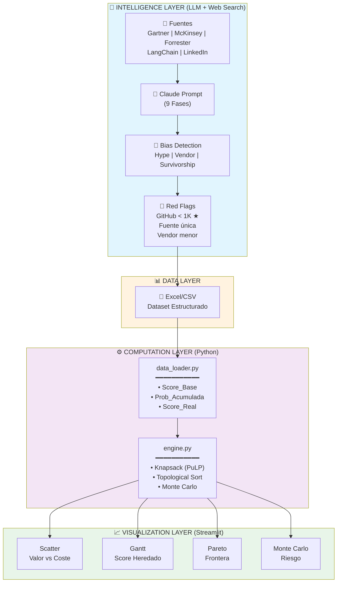
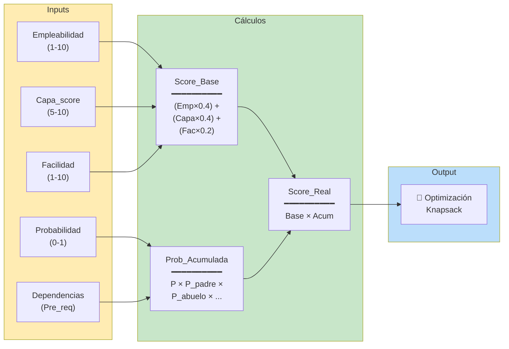
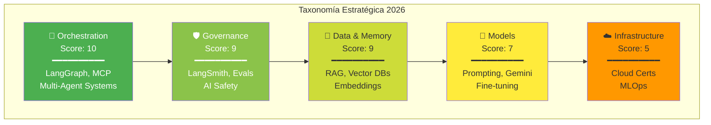
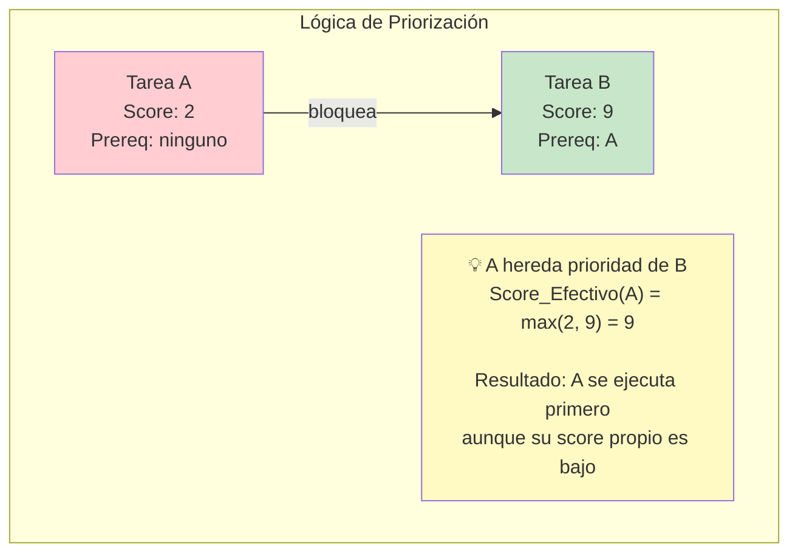
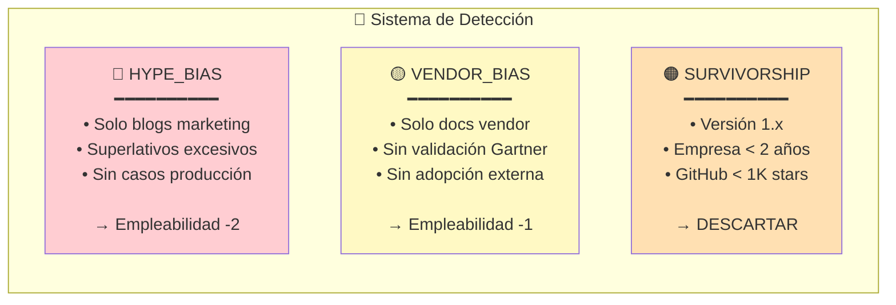

# Arquitectura SPO - Strategic Portfolio Optimizer

## Diagrama de Flujo Principal



## Flujo de Cálculo del Score



## Taxonomía de Capas



## Algoritmo de Gantt (Score Heredado)



## Detección de Sesgos



---

## Stack Tecnológico

| Capa | Tecnología | Rol |
|------|------------|-----|
| Intelligence | Claude API + Web Search | Investigación de tendencias |
| Data | Excel/CSV + Pandas | Almacenamiento estructurado |
| Compute | PuLP (CBC Solver) | Optimización Knapsack |
| Analytics | NumPy | Monte Carlo simulation |
| Visualization | Plotly | Gráficos interactivos |
| UI | Streamlit | Interface web |

---

## Decisiones Arquitectónicas Clave

### ¿Por qué híbrido LLM + Algoritmo?

```
┌─────────────────────────────────────────────────────────────┐
│                    PROBLEMA                                  │
├─────────────────────────────────────────────────────────────┤
│ "¿Qué aprendo para maximizar mi empleabilidad en 2026?"     │
└─────────────────────────────────────────────────────────────┘
                            │
            ┌───────────────┴───────────────┐
            ▼                               ▼
┌───────────────────────┐       ┌───────────────────────┐
│ PARTE NO ESTRUCTURADA │       │ PARTE ESTRUCTURADA    │
├───────────────────────┤       ├───────────────────────┤
│ • ¿Qué tecnologías    │       │ • ¿Cuáles hago        │
│   importan?           │       │   primero?            │
│ • ¿Cuáles tienen      │       │ • ¿Caben en mi        │
│   hype vs realidad?   │       │   presupuesto?        │
│ • ¿Qué dicen los      │       │ • ¿En qué orden       │
│   analistas?          │       │   (dependencias)?     │
├───────────────────────┤       ├───────────────────────┤
│ SOLUCIÓN: LLM         │       │ SOLUCIÓN: Matemáticas │
│ (Claude + Web Search) │       │ (Knapsack + LP)       │
└───────────────────────┘       └───────────────────────┘
```

### Principio de Diseño

> **"LLMs para lo que cambia. Algoritmos para lo que se optimiza."**

El mercado de AI cambia cada mes → LLM lo escanea.
Las restricciones de tiempo/dinero son fijas → Algoritmo las optimiza.
