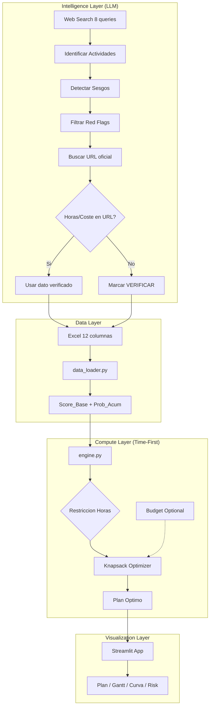
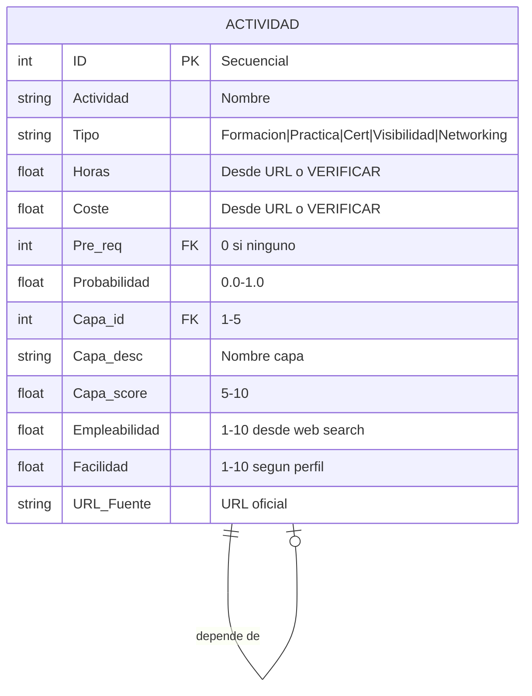
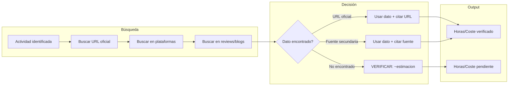
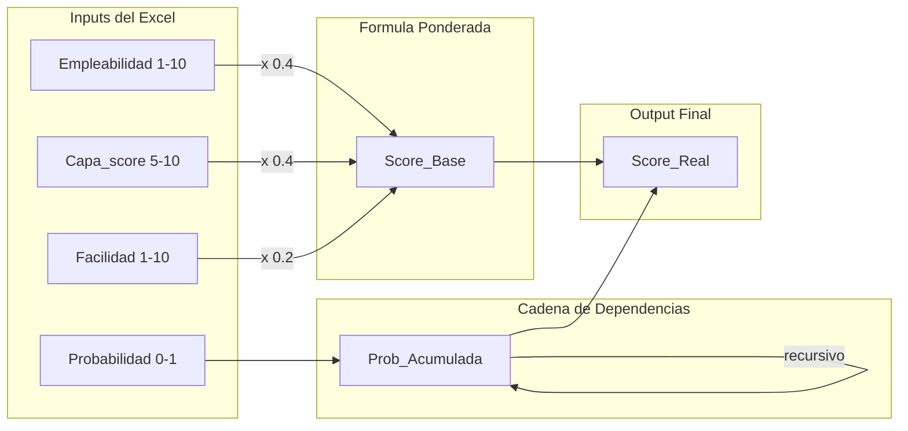
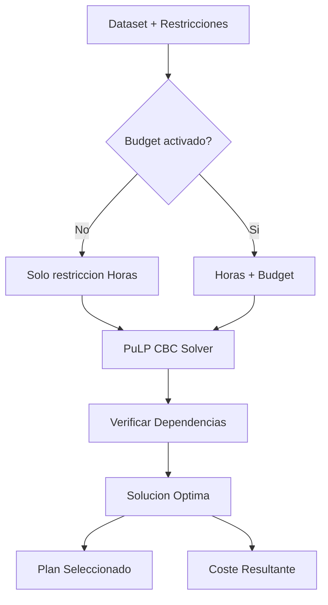
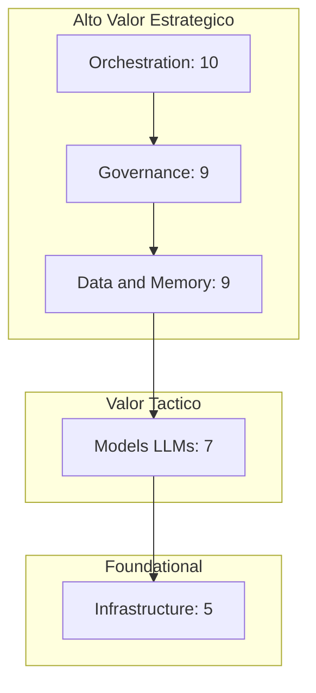
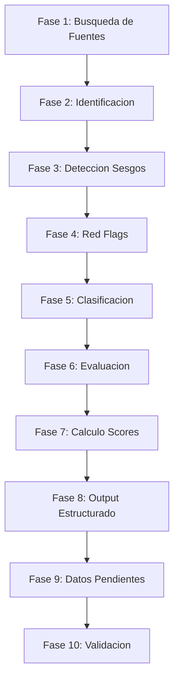
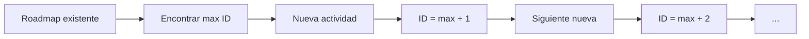

# SPO Architecture

Documentación técnica de la arquitectura del Strategic Portfolio Optimizer.

---

## 1. Flujo Principal (Time-First + Data Verification)

---

## 2. Esquema de Datos (12 columnas)

---

## 3. Flujo de Verificación de Datos

---

## 4. Flujo de Cálculo del Score

---

## 5. Algoritmo Knapsack (Time-First)

---

## 6. Taxonomía de Capas

---

## 7. Proceso del Prompt (10 Fases)

---

## 8. Reglas de IDs

**Ejemplo:**
- Roadmap actual: IDs 1-18
- Primera actividad nueva: ID 19
- Segunda actividad nueva: ID 20

---

## 9. Componentes del Sistema

| Componente | Archivo | Responsabilidad |
|------------|---------|-----------------|
| UI | app.py | Streamlit dashboard |
| ETL | data_loader.py | Carga Excel, calcula Score_Base, Prob_Acum |
| Optimizer | engine.py | Knapsack, Gantt, Monte Carlo |
| Prompt | AI_Trend_Scanner_v2.2.md | Research + verificacion datos |
| Data | Roadmap_2026.xlsx | Dataset 12 columnas |

---

## 10. Decisiones Técnicas

| Decisión | Alternativa descartada | Razón |
|----------|------------------------|-------|
| PuLP/CBC | Gurobi, CPLEX | Gratuito, suficiente para N<100 |
| Streamlit | Dash, Gradio | Prototipado rápido |
| Excel | SQLite, Postgres | Portabilidad, edición manual |
| Time-First | Dual constraint | Horas siempre binding |
| URL verification | Estimación libre | Precisión de datos |
| IDs secuenciales | IDs tipo "NEW*" | Compatibilidad Pre_req |
