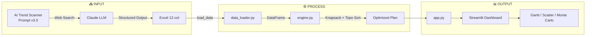

# 🎯 Strategic Portfolio Optimizer (SPO)

> **Sistema híbrido de IA para optimización de portfolios de upskilling profesional**

[](https://opensource.org/licenses/MIT)
[](https://www.python.org/downloads/)
[](https://streamlit.io/)

## 📋 Índice

- [Descripción](#-descripción)
- [Arquitectura](#-arquitectura)
- [Características](#-características)
- [Instalación](#-instalación)
- [Uso](#-uso)
- [Modelo Matemático](#-modelo-matemático)
- [Estructura del Proyecto](#-estructura-del-proyecto)
- [Contribuir](#-contribuir)
- [Licencia](#-licencia)

---

## 🧠 Descripción

**Strategic Portfolio Optimizer (SPO)** es un sistema de decisión que combina:

1. **LLM Research Agent** (Claude) — Análisis de tendencias del mercado de IA mediante web search
2. **Optimization Engine** (PuLP) — Algoritmo de mochila (Knapsack) para maximización bajo restricciones
3. **Visualization Dashboard** (Streamlit) — Interfaz interactiva para simulación de escenarios

### El Problema que Resuelve

Un profesional de Data & AI tiene recursos limitados (tiempo, dinero) y decenas de opciones de formación. ¿Cómo priorizar?

**Enfoque tradicional:** Intuición + FOMO  
**Enfoque SPO:** Optimización matemática + Señales de mercado + Gestión de riesgo

### Filosofía "Time-First"

En 2026, el conocimiento de IA es abundante y barato (Open Source). El cuello de botella real no es el dinero, es el **tiempo cognitivo disponible**. SPO prioriza las horas como restricción principal, dejando el presupuesto como filtro opcional.

---

## 🏗️ Arquitectura

```
┌─────────────────────────────────────────────────────────────────────────────┐
│                         STRATEGIC PORTFOLIO OPTIMIZER                        │
├─────────────────────────────────────────────────────────────────────────────┤
│                                                                             │
│  ┌──────────────────┐    ┌──────────────────┐    ┌──────────────────────┐  │
│  │  🔍 AI RESEARCH  │    │  📊 DATA LAYER   │    │  ⚙️ OPTIMIZATION     │  │
│  │     AGENT        │    │                  │    │     ENGINE           │  │
│  │                  │    │                  │    │                      │  │
│  │  Claude + Web    │───▶│  Excel/CSV       │───▶│  PuLP Knapsack       │  │
│  │  Search          │    │  12-column       │    │  + Topological       │  │
│  │                  │    │  schema          │    │  Sort                │  │
│  │  AI Trend        │    │                  │    │                      │  │
│  │  Scanner v3.0    │    │  data_loader.py  │    │  engine.py           │  │
│  └──────────────────┘    └──────────────────┘    └──────────────────────┘  │
│           │                       │                        │                │
│           │                       │                        │                │
│           ▼                       ▼                        ▼                │
│  ┌─────────────────────────────────────────────────────────────────────┐   │
│  │                      📈 VISUALIZATION LAYER                          │   │
│  │                           (Streamlit)                                │   │
│  │  ┌─────────┐  ┌─────────┐  ┌─────────┐  ┌─────────┐  ┌──────────┐   │   │
│  │  │ Context │  │  Plan   │  │  Gantt  │  │  Value  │  │  Monte   │   │   │
│  │  │  Tab    │  │   Tab   │  │   Tab   │  │  Curve  │  │  Carlo   │   │   │
│  │  └─────────┘  └─────────┘  └─────────┘  └─────────┘  └──────────┘   │   │
│  └─────────────────────────────────────────────────────────────────────┘   │
│                                                                             │
└─────────────────────────────────────────────────────────────────────────────┘
```

### Flujo de Datos



---

## ✨ Características

### Motor de Optimización

| Característica | Descripción |
|----------------|-------------|
| **Knapsack Binario** | Maximiza valor bajo restricciones de tiempo y presupuesto |
| **Dependencias Topológicas** | Respeta prerrequisitos entre actividades (DAG) |
| **Probabilidad Acumulada** | Propaga incertidumbre a través de cadenas de dependencia |
| **Score Heredado** | Prioriza tareas que desbloquean alto valor downstream |

### Análisis de Riesgo

| Característica | Descripción |
|----------------|-------------|
| **Monte Carlo** | 500 simulaciones con variabilidad en tiempo y éxito |
| **Percentiles** | P50 (realista), P90 (pesimista) para planificación |
| **Curva de Valor** | Análisis de rendimientos marginales decrecientes |

### Taxonomía Estratégica

| Capa | Score | Descripción |
|------|-------|-------------|
| 1. Orchestration | 10 | Agentes, MCP, LangGraph, multi-agent |
| 2. Governance | 9 | Observabilidad, evals, AI TRiSM |
| 3. Data & Memory | 9 | RAG, vector DBs, embeddings |
| 4. Models (LLMs) | 7 | Prompting, fine-tuning |
| 5. Infrastructure | 5 | Cloud certs, MLOps |

---

## 🚀 Instalación

### Requisitos

- Python 3.9+
- pip

### Setup

```bash
# Clonar repositorio
git clone https://github.com/tu-usuario/strategic-portfolio-optimizer.git
cd strategic-portfolio-optimizer

# Crear entorno virtual
python -m venv venv
source venv/bin/activate  # Linux/Mac
# venv\Scripts\activate   # Windows

# Instalar dependencias
pip install -r requirements.txt

# Ejecutar
streamlit run app.py
```

### Dependencias

```
streamlit
pandas
pulp
plotly
numpy
openpyxl
xlsxwriter
```

---

## 📖 Uso

### 1. Preparar Datos (AI Trend Scanner)

Usa el prompt `AI_TREND_SCANNER_v3.0.docx` en Claude con web search para generar/actualizar tu roadmap.

**Esquema de datos requerido (12 columnas):**

| Columna | Tipo | Descripción |
|---------|------|-------------|
| ID | Integer | Identificador único secuencial |
| Actividad | String | Nombre de la actividad |
| Tipo | Enum | Formación IA / IA Práctica / Certificación / Visibilidad / Networking |
| Horas | Integer | Tiempo estimado de dedicación |
| Coste | Integer | Coste en euros |
| Pre_req | Integer | ID del prerrequisito (0 si no tiene) |
| Probabilidad | Float | Probabilidad de éxito (0-1) |
| Capa_id | Integer | ID de capa según taxonomía (1-5) |
| Capa_desc | String | Nombre de la capa |
| Capa_score | Integer | Score fijo de la capa |
| Empleabilidad | Integer | Demanda del mercado (1-10) |
| Facilidad | Integer | Facilidad para tu perfil (1-10) |

### 2. Cargar en Excel

Pega los datos en la pestaña `4_Actividades_Priorizadas` del archivo `Roadmap_2026_CORREGIDO.xlsx`.

### 3. Ejecutar Dashboard

```bash
streamlit run app.py
```

### 4. Ajustar Restricciones

- **Slider de Horas:** Tu bolsa anual de tiempo disponible
- **Checkbox Presupuesto:** Activa/desactiva límite de gasto
- **Velocidad (h/semana):** Para cálculo del Gantt

---

## 📐 Modelo Matemático

### Función Objetivo

```
Maximizar: Σ (Score_Real_i × x_i)
```

Donde `x_i ∈ {0, 1}` indica si la actividad i está seleccionada.

### Restricciones

```
Σ (Horas_i × x_i) ≤ Tiempo_Disponible          [Principal]
Σ (Coste_i × x_i) ≤ Presupuesto                [Opcional]
x_i ≤ x_j  ∀ (i, j) donde j = Pre_req(i)       [Dependencias]
```

### Cálculo de Scores

```python
Score_Base = (Empleabilidad × 0.4) + (Capa_score × 0.4) + (Facilidad × 0.2)

# Probabilidad acumulada (recursiva)
if Pre_req == 0:
    Prob_Acumulada = Probabilidad
else:
    Prob_Acumulada = Probabilidad × Prob_Acumulada(Pre_req)

Score_Real = Score_Base × Prob_Acumulada
```

### Gantt con Score Heredado

El orden de ejecución no es arbitrario. Se usa ordenación topológica con prioridad por "potencial desbloqueado":

```python
Effective_Score(i) = max(Score_Real(i), max(Effective_Score(children(i))))
```

Esto asegura que tareas pequeñas que desbloquean tareas grandes se ejecuten primero.

---

## 📁 Estructura del Proyecto

```
strategic-portfolio-optimizer/
├── app.py                      # Streamlit dashboard
├── engine.py                   # Motor de optimización
├── data_loader.py              # Carga y preprocesamiento
├── requirements.txt            # Dependencias
├── Roadmap_2026_CORREGIDO.xlsx # Datos de ejemplo
├── prompts/
│   └── AI_TREND_SCANNER_v3.docx # Prompt para Claude
├── docs/
│   ├── ARCHITECTURE.md         # Diagrama detallado
│   └── STATISTICAL_AUDIT.md    # Auditoría matemática
├── LICENSE                     # MIT License
└── README.md                   # Este archivo
```

---

## 🧪 Validación

### Dataset de Ejemplo

El repositorio incluye un dataset de 18 actividades validadas para un perfil de **Data & AI Leader**:

- **5 actividades** en Capa 1 (Orchestration)
- **2 actividades** en Capa 2 (Governance)
- **5 actividades** en Capa 3 (Data & Memory)
- **3 actividades** en Capa 4 (Models)
- **3 actividades** en Capa 5 (Infrastructure)

**Estadísticas clave:**
- Horas totales: 442h
- Coste total: 685€
- Score_Real medio: 6.88 puntos
- Correlación Prob → Score_Real: 0.91

---

## 🤝 Contribuir

1. Fork del repositorio
2. Crear rama feature (`git checkout -b feature/nueva-funcionalidad`)
3. Commit cambios (`git commit -am 'Add: nueva funcionalidad'`)
4. Push a la rama (`git push origin feature/nueva-funcionalidad`)
5. Crear Pull Request

### Ideas para Contribuir

- [ ] Integración con Google Sheets API
- [ ] Export a Notion/Obsidian
- [ ] Multi-usuario con perfiles diferentes
- [ ] API REST para integraciones
- [ ] Tests unitarios con pytest

---

## 📄 Licencia

Este proyecto está bajo la Licencia MIT. Ver [LICENSE](LICENSE) para más detalles.

---

## 👤 Autor

**Javier** — Senior Data Project Lead @ Randstad Digital

- LinkedIn: [tu-perfil]
- Medium: [tu-blog]

---

## 🙏 Agradecimientos

- **Anthropic Claude** — Motor de investigación de tendencias
- **Google Gemini** — Desarrollo de la aplicación Streamlit
- **PuLP** — Librería de optimización lineal
- **Streamlit** — Framework de dashboards

---

<p align="center">
  <i>Built with 🧠 and ☕ for the AI upskilling community</i>
</p>
